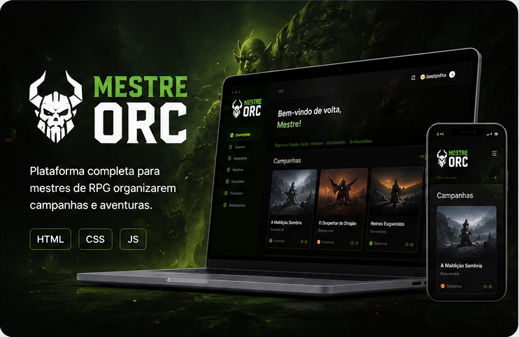

# Portfólio Evandro Ricardo - Estilo Mestre Orc

Versão mais escura, compacta e com estética inspirada no projeto Mestre Orc.

## Como usar
Coloque todos os arquivos na raiz do repositório:

- `index.html`
- `style.css`
- `script.js`
- `thumb-mestre-orc.png`
- `thumb-controle-financeiro.png`
- `thumb-hamburgueria.png`
- `thumb-portfolio-dev.png`

As imagens já estão chamadas direto pela raiz, por exemplo:

```html

```

## O que mudou

- Visual escuro e sofisticado.
- Menos rolagem vertical.
- Textos mais curtos.
- Projetos em grid compacto.
- Hero com destaque forte para o Mestre Orc.
- CTAs diretos para WhatsApp.
